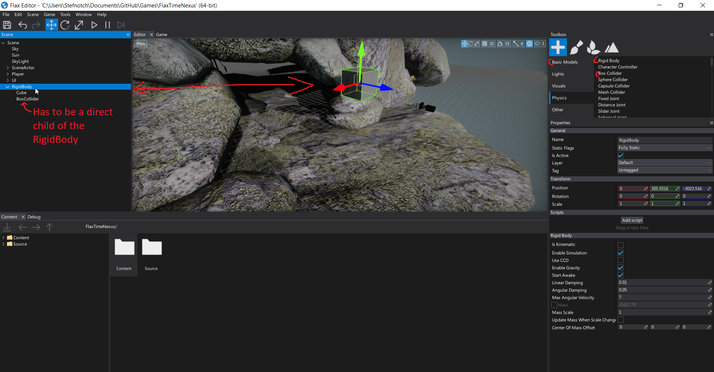

# Arno - Tuesday Goal - [Traps!](http://i0.kym-cdn.com/entries/icons/original/000/000/157/itsatrap.jpg)

The goal is to create some (deadly) traps.

e.g. [Rolling boulder](https://latimesherocomplex.files.wordpress.com/2011/08/ij1_ia_454_r.jpg), [Spike traps](https://youtu.be/UfKmSfgFxi8?t=459), Dart traps

## [Some pointers](https://xkcd.com/138/)

- You'll need some object that damage the player when he [collides](https://docs.flaxengine.com/manual/physics/collisions.html#collisions-detection) with them

- Here is how to create a physics object that obeys physics

  

- You'll need to attach a script that handles the collision to the RigidBody or BoxCollider[1](Other colliders are also fine) (I'm not sure which one. Maybe both of them work?) 

  It's probably going to look something like that: (Note: Check out `Projectile.cs` in the repository. It's an example script that might work.)

  ```csharp
  public class Projectile : Script
  {
      void OnCollisionEnter(Collision collision)
      {
        if(collision.OtherCollider//TODO: Check if it's a player and everything
      }
  }
  ```

- Depending on what the trap is, you might have to create stuff (e.g. dart-projectiles) using code.
